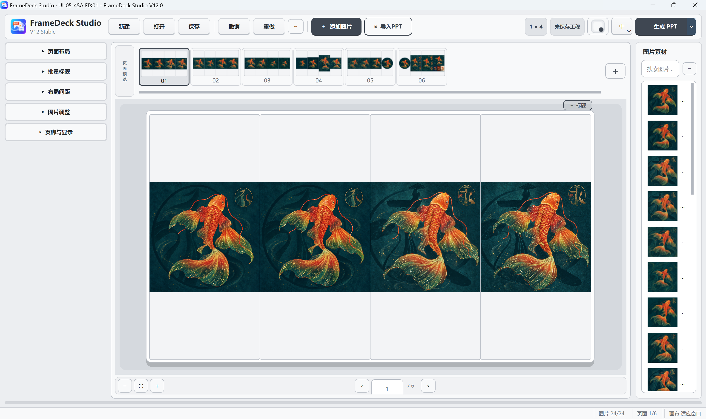
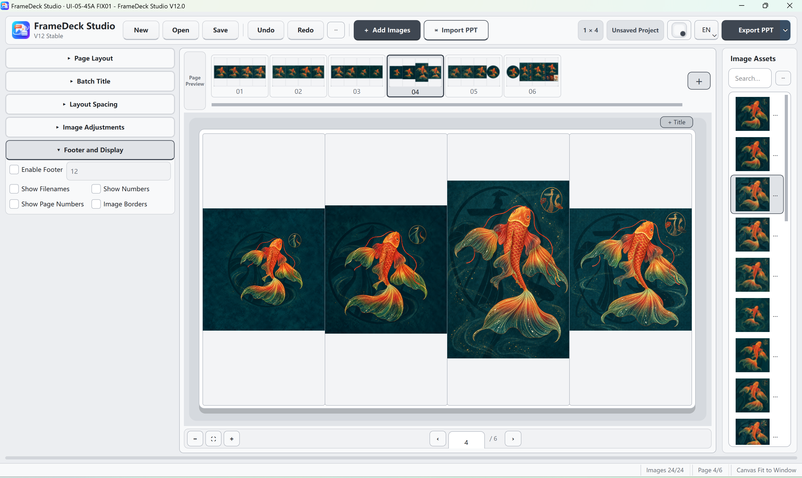

# FrameDeck Studio

FrameDeck Studio is an open-source desktop application that turns image
collections into structured, presentation-ready pages and exports them to
PowerPoint, PDF, or page images.

FrameDeck Studio 是一款开源桌面图片排版工具，可以将大量图片快速整理成结构清晰的多页版面，并导出为 PowerPoint、PDF 或单页图片。

## About FrameDeck Studio / 软件介绍

FrameDeck Studio is designed for workflows where many reference images need to
be reviewed, grouped, reordered, titled, and presented consistently. Instead of
manually placing every image in presentation software, users can choose a
rows-by-columns layout, import an image collection, and let Auto Layout fill
pages continuously. The generated pages remain editable: images can be moved
within a page or across pages, copied, cut, pasted, cropped, titled, and
rearranged before export.

It is suitable for:

- photography selection and contact-sheet presentations
- visual reference boards and mood boards
- character, costume, prop, and environment design collections
- film, animation, game, advertising, and AI-art development reviews
- product comparison, portfolio, archive, and teaching-material layouts

### Core capabilities / 核心能力

- Continuous Auto Layout with configurable rows, columns, gaps, and page size.
- Confirm Layout mode for keeping page boundaries while making manual edits.
- Page-aware drag-and-drop, including movement between different pages.
- Project-level copy, cut, and paste into the currently selected page.
- Non-destructive editable PowerPoint cropping that retains the full source
  image for later reset or recropping.
- Batch titles, page titles, footer/display options, and spacing controls.
- Saveable .fds projects with undo/redo and automatic recovery support.
- JPG, PNG, and HEIF/HEIC import, plus PowerPoint, PDF, and image export.
- Chinese and English interfaces, five coordinated themes, and high-DPI support.

### Interface preview / 界面预览

#### 中文界面



#### English interface



## v12.1.0 highlights

- Auto Layout continuously fills the current rows × columns grid.
- Confirm Layout keeps the generated page boundaries so later edits do not
  pull images forward. Cancelling restores the pre-layout version.
- Page-aware image movement across pages.
- Project clipboard copy, cut, and paste.
- Editable crop export keeps the original image embedded in the PPT.
- Batch titles, spacing controls, bilingual Chinese/English UI, and five themes.
- HEIF/HEIC import when `pillow-heif` is available.

## Downloads / 下载

Download the Windows and macOS packages from the unified [v12.1.0 GitHub Release](https://github.com/lzy4107932-commits/FrameDeck-Studio/releases/tag/v12.1.0) after it is published.

### Windows

- **Portable**: run directly without Python.
- **Installer**: installs the application and creates optional shortcuts.

Windows 10/11 x64 is supported. The first release may show the Windows
SmartScreen unknown-publisher prompt because the binaries are not code-signed.

### macOS

- **DMG**: recommended for normal installation.
- **ZIP**: backup application archive.
- **Architecture**: Apple Silicon ARM64 (M1, M2, M3, M4, and later).
- **Minimum configured version**: macOS 12.

The macOS build was manually installed and tested on a Mac mini with Apple M4,
16 GB memory, and macOS 26.6.1. It is not code-signed or notarized. On first
launch, copy the app to Applications, try to open it once, then use **System
Settings → Privacy & Security → Open Anyway**. Do not disable Gatekeeper
system-wide. See the [Chinese macOS installation guide](macOS安装说明.md).

## Run from source

```powershell
python -m pip install -r requirements.txt
python main.py
```

Run the test suite:

```powershell
python -m unittest discover -s tests
```

## Build Windows packages

```powershell
python FrameDeck_UI05_51A_packaging_preflight.py --build-portable --smoke-exe
```

Install Inno Setup 6, build the portable EXE first, then run:

```powershell
build_setup_installer.bat
```

Portable output is written to `dist/`. Installer output is written to
`installer/output/`. Generated builds and user projects are excluded by
`.gitignore`.

## Build macOS packages

Build locally on an Apple Silicon Mac with:

```bash
python3 -m pip install -r requirements-build.txt
bash build_macos.sh
```

## License

FrameDeck Studio source code is released under the [MIT License](LICENSE).
See [THIRD_PARTY_LICENSES.md](THIRD_PARTY_LICENSES.md) for dependency notices.
